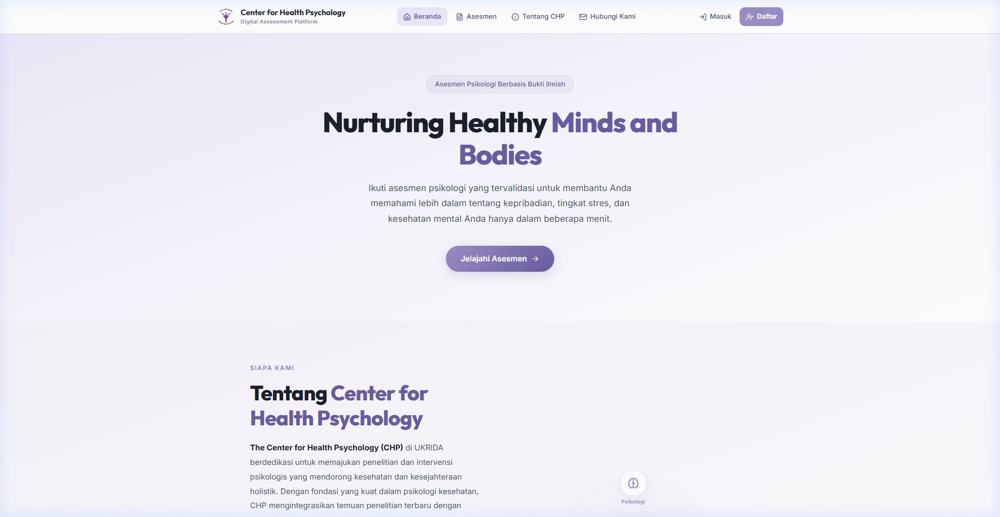
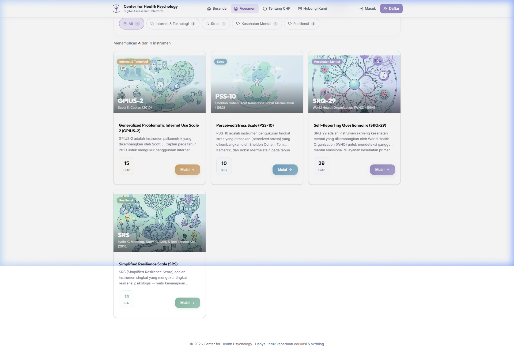
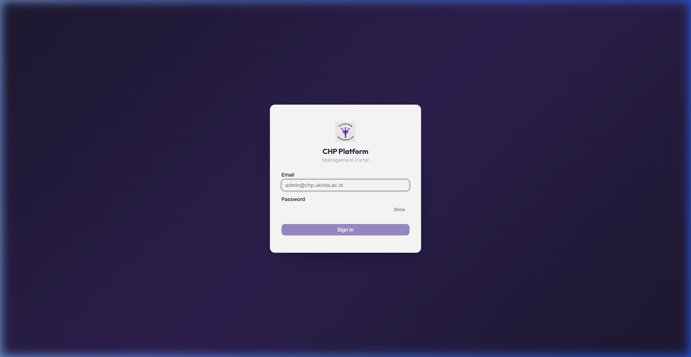

<p align="center">
  
</p>

<h1 align="center">CHP Digital Assessment Platform</h1>

<p align="center">
  <strong>Validated psychometric screening for the Center for Health Psychology, UKRIDA Jakarta</strong>
</p>

<p align="center">
  <a href="https://github.com/TycherosElfida/Center-for-Health-Psychology/actions/workflows/ci.yml">
    
  </a>
  <a href="https://chp.my.id">
    
  </a>
  
  
  
</p>

---

A web application for the **Center for Health Psychology (CHP)** at Universitas Kristen Krida Wacana (UKRIDA), Jakarta. Delivers validated psychometric instruments, computes clinical scores, and produces interpretive reports — all in Bahasa Indonesia.

<p align="center">
  
</p>

## Table of Contents

- [Screenshots](#screenshots)
- [Psychometric Instruments](#psychometric-instruments)
- [Tech Stack](#tech-stack)
- [Project Structure](#project-structure)
- [Getting Started](#getting-started)
  - [Prerequisites](#prerequisites)
  - [Local Setup](#local-setup)
  - [Running with Docker](#running-with-docker)
- [Environment Variables](#environment-variables)
- [Architecture Overview](#architecture-overview)
- [Admin Access](#admin-access)
- [Testing](#testing)
- [CI/CD](#cicd)
- [Deployment](#deployment)
- [Key Scripts](#key-scripts)
- [Known Limitations](#known-limitations)
- [Academic Context & License](#academic-context--license)

---

## Screenshots

<table>
  <tr>
    <td align="center"><strong>Assessment Catalog</strong></td>
    <td align="center"><strong>Admin Login</strong></td>
  </tr>
  <tr>
    <td></td>
    <td></td>
  </tr>
</table>

---

## Psychometric Instruments

| Instrument | Full Name | Items | Construct Measured |
|:-----------|:----------|:-----:|:-------------------|
| **PSS-10** | Perceived Stress Scale (10-item) | 10 | Perceived unpredictability, uncontrollability, and overload — past 30 days |
| **GPIUS-2** | Generalized Problematic Internet Use Scale 2 | 15 | Five dimensions of problematic internet use (POSI, Mood Regulation, Cognitive Preoccupation, Compulsive Use, Negative Outcomes) — Indonesian adaptation by Reynaldo & Sokang (2016, UKRIDA) |
| **SRS** | Simplified Resilience Score | 11 | Psychological resilience: Efficacy, Satisfaction, and Control — adapted from Manning, Carr & Kail (2016) |
| **SRQ-29** | Self-Reporting Questionnaire (29-item) | 29 | Four clinical domains: Anxiety/Depression, Substance Use, Psychotic Symptoms, and PTSD — Indonesian Kemenkes adaptation (RISKESDAS) |

> All results are screening indicators, not clinical diagnoses. Each result page displays the instrument's foundational citations and a referral recommendation.

---

## Tech Stack

| Layer | Technology |
|:------|:-----------|
| Framework | Next.js 16 (App Router) |
| Language | TypeScript 6 (strict mode) |
| UI | React 19, Tailwind CSS 4, shadcn/ui, Motion |
| API | tRPC v11 |
| Database | Neon PostgreSQL via Drizzle ORM |
| Auth (users) | Auth.js v5 (credentials provider) |
| Auth (admin) | Custom JWT via `jose` — separate system, never mixed with user auth |
| Rate limiting | Upstash Redis |
| Email | Resend |
| Observability | Sentry |
| PDF reports | `@react-pdf/renderer` |
| Unit tests | Vitest (213 passing across 25 test files) |
| E2E tests | Playwright (7 specs) |
| CI/CD | GitHub Actions + Vercel |

---

## Project Structure

```
chpv2/
├── .github/workflows/     # CI pipeline (lint → typecheck → build → test)
├── e2e/                    # Playwright E2E test specs
├── docs/
│   ├── LaporanKP/          # Laporan Kerja Praktik (LaTeX)
│   └── screenshots/        # README screenshots
├── public/                 # Static assets & uploaded images
├── src/
│   ├── app/                # Next.js App Router pages & layouts
│   │   ├── (public)/       #   Public-facing routes (/tests, /results)
│   │   └── admin/          #   Admin panel routes (/admin/*)
│   ├── components/         # React UI components (shadcn/ui)
│   ├── hooks/              # Custom React hooks
│   ├── lib/                # Shared utilities, admin-auth, schemas
│   ├── server/
│   │   ├── db/             #   Drizzle ORM config, schema, seed
│   │   ├── scoring/        #   Pure scoring engine & interpretation
│   │   └── trpc/           #   tRPC router & procedures
│   ├── __tests__/          # Vitest unit/integration tests
│   └── types/              # Shared TypeScript types
├── Dockerfile              # Multi-stage Docker build
├── docker-compose.yml      # Dev mode (hot reload)
├── docker-compose.prod.yml # Production-style build
├── drizzle.config.ts       # Drizzle ORM configuration
├── playwright.config.ts    # Playwright E2E configuration
└── vitest.config.ts        # Vitest test configuration
```

---

## Getting Started

### Prerequisites

- **Node.js 22+**
- **pnpm 9+** — `npm install -g pnpm`
- Accounts on:
  - [Neon](https://neon.tech) — managed PostgreSQL
  - [Upstash](https://upstash.com) — Redis for rate limiting
  - [Resend](https://resend.com) — transactional email
  - [Sentry](https://sentry.io) — error monitoring

### Local Setup

```bash
# 1. Clone and install
git clone https://github.com/TycherosElfida/Center-for-Health-Psychology.git
cd Center-for-Health-Psychology
pnpm install

# 2. Configure environment
cp .env.example .env.local
# Fill in each value — see Environment Variables section below

# 3. Push the schema to Neon
pnpm db:push

# 4. Seed instruments and create the first admin account
#    (ADMIN_EMAIL and ADMIN_PASSWORD must be set in .env.local)
pnpm db:seed

# 5. Start the dev server
pnpm dev
# Open http://localhost:3000
```

The seed script is idempotent — re-running it skips existing rows. Admin bootstrap is skipped if `ADMIN_EMAIL` / `ADMIN_PASSWORD` are unset, but all other seed data still runs.

### Running with Docker

Docker provides an alternative to the native local setup above. Two modes are available:

**Prerequisites:** [Docker Desktop](https://www.docker.com/products/docker-desktop/) (or Docker Engine + Compose plugin on Linux) and a populated `.env.local` file.

**Development (hot reload):**

```bash
docker compose --env-file .env.local up --build
```

This bind-mounts the project directory into the container. Editing files under `src/` triggers Next.js Fast Refresh automatically — no restart needed.

**Production-style (optimized build):**

```bash
docker compose -f docker-compose.prod.yml --env-file .env.local up --build
```

Builds an optimized standalone Next.js image suitable for demos and review. Not a replacement for the Vercel production deployment.

> **Important notes:**
> - `--env-file .env.local` is **required** on every `docker compose` command.
> - Database migrations are not automatic. Run `pnpm db:push` on the host before first use.
> - The container connects to the **real Neon database and Upstash Redis** — there are no local database containers.

---

## Environment Variables

| Variable | Description |
|:---------|:------------|
| `DATABASE_URL` | Neon PostgreSQL connection string |
| `AUTH_SECRET` | Random secret for Auth.js session signing |
| `ADMIN_JWT_SECRET` | Random secret for admin JWT signing (separate from user auth) |
| `ENCRYPTION_KEY` | 32-byte hex key for encrypting sensitive fields |
| `ADMIN_EMAIL` | Email for the initial super_admin account (seed-time only) |
| `ADMIN_PASSWORD` | Password for the initial super_admin account (seed-time only) |
| `UPSTASH_REDIS_REST_URL` | Upstash Redis URL for rate limiting |
| `UPSTASH_REDIS_REST_TOKEN` | Upstash Redis token |
| `RESEND_API_KEY` | Resend API key for transactional email |
| `RESEND_FROM_EMAIL` | Verified sender address on Resend |
| `SENTRY_DSN` | Sentry DSN for error tracking |
| `SENTRY_AUTH_TOKEN` | Sentry auth token — required for production builds |

> Generate fresh values for `AUTH_SECRET`, `ADMIN_JWT_SECRET`, and `ENCRYPTION_KEY` for production. Never reuse local development values.

See [`.env.example`](.env.example) for detailed comments on each variable.

---

## Architecture Overview

The application is a Next.js 16 App Router project with two distinct areas:

**Public site** — assessment catalog, individual test flows (`/test/[slug]`), and result pages (`/results/[scoreId]`). Supports anonymous (guest) and authenticated user sessions. Anonymous sessions receive a 72-hour claim token so guests can register after completing an assessment and retroactively own their result.

**Admin panel** — at `/admin/`, using a deliberately separate authentication system (custom JWT via `jose`) that shares no cookies or database tables with the user-facing Auth.js v5 system. This separation prevents privilege escalation if either system has a vulnerability.

**Data flow** — all server-side data access goes through tRPC v11 procedures in `src/server/trpc/procedures/`. These talk to Neon PostgreSQL via Drizzle ORM.

**Scoring engine** — `src/server/scoring/engine.ts` is a pure function with no database calls or side effects. Given an answer map and question metadata, it returns total score, dimension scores, dimension max scores, and `maxPossibleScore`. Interpretation lookup is a separate function in `interpretation.ts` that queries the `result_interpretations` table and snapshots the result into the `results.computed_scores` JSONB column at submit time.

**PDF reports** — generated server-side via `@react-pdf/renderer` from assembled report data. Email delivery is queued through Resend via the `report_requests` table and requires admin approval before sending.

---

## Admin Access

The seed script creates a single super_admin account from environment variables:

1. Set `ADMIN_EMAIL` and `ADMIN_PASSWORD` in `.env.local`.
2. Run `pnpm db:seed`. The password is hashed with bcrypt; the account is created with `mustChangePassword: true`.
3. Log in at `/admin/login`. The first login will prompt for a new password.

Re-running `pnpm db:seed` with the same `ADMIN_EMAIL` is a no-op.

---

## Testing

### Unit Tests (Vitest)

```bash
pnpm test              # Run all tests
pnpm test:watch        # Watch mode
pnpm test:coverage     # Coverage report
```

213 tests across 25 files covering: scoring engine, interpretation data, psychometric instrument configurations, admin authentication, schema validation, seed policy, and admin results.

### E2E Tests (Playwright)

```bash
pnpm test:e2e          # Run all E2E specs
```

7 Playwright specs covering: authentication flows, admin auth, admin instruments, assessment end-to-end flow, navigation, and privacy flow.

> **Note:** E2E tests require a running dev server (`pnpm dev`) or a `webServer` configuration in `playwright.config.ts`.

---

## CI/CD

### GitHub Actions

Every push to `master` and every pull request triggers a CI pipeline (`.github/workflows/ci.yml`):

| Step | Command |
|:-----|:--------|
| Lint | `pnpm exec eslint .` |
| Typecheck | `pnpm tsc --noEmit` |
| Build | `pnpm build` |
| Unit Tests | `pnpm test` |

### Pre-commit Hooks

[Husky](https://typicode.github.io/husky/) + [lint-staged](https://github.com/lint-staged/lint-staged) run on every commit:

- `eslint --fix` on staged `.ts` / `.tsx` files
- `prettier --write` on staged `.ts` / `.tsx` files

### Vercel Deployments

- **Production** deploys automatically on push to `master`
- **Preview** deploys on every pull request, with a unique URL for review

---

## Deployment

Recommended target: **Vercel**.

1. Push to `master` on GitHub.
2. Import the repository into Vercel — Next.js is auto-detected.
3. Add all environment variables from `.env.example` in **Project → Settings → Environment Variables**. Critical for the build step:
   - `DATABASE_URL` — must point to the production Neon branch
   - `SENTRY_AUTH_TOKEN` — required; the build fails without it
   - `AUTH_SECRET`, `ADMIN_JWT_SECRET`, `ENCRYPTION_KEY` — generate fresh secrets for production
4. If the production database has not been initialized, run `pnpm db:push` and `pnpm db:seed` locally with the production `DATABASE_URL` set, then redeploy.

---

## Key Scripts

| Script | Purpose |
|:-------|:--------|
| `pnpm dev` | Start Next.js in development mode |
| `pnpm build` | Production build |
| `pnpm test` | Run the Vitest suite |
| `pnpm test:e2e` | Run Playwright E2E tests |
| `pnpm lint` | Run ESLint |
| `pnpm db:push` | Apply Drizzle schema directly to the database |
| `pnpm db:seed` | Seed instruments, interpretations, citations, and optional admin account |
| `pnpm db:studio` | Open Drizzle Studio for the configured database |
| `pnpm db:generate` | Generate a migration from the current schema |

---

## Known Limitations

A detailed limitations document is available at [`docs/keterbatasan-platform-chp.md`](docs/keterbatasan-platform-chp.md) (in Bahasa Indonesia). It covers:

- **Psikometri** — ambang batas heuristik per instrumen, status validasi normatif lokal, pertanyaan terbuka kepada Dekan Psikologi untuk SRS
- **Fitur yang belum diimplementasikan** — manajemen pertanyaan dan skala di admin, verifikasi email, reset password, log audit, migrasi hasil tamu ke akun
- **Teknis** — Dual Source of Truth pada data pertanyaan, hasil historis dengan denominasi DSR yang salah, tabel schema yang belum digunakan

---

## Academic Context & License

This platform is an undergraduate internship (*Kerja Praktik*) deliverable prepared for the Center for Health Psychology at UKRIDA Jakarta (2026 academic term).

| | |
|:--|:--|
| **Lead developer** | Sanders (NIM 412023020) |
| **Co-developer (UI/UX)** | Febriane Veranica |
| **Handover date** | 2026-05-22 |
| **Supervisor** | Dean of Psychology, UKRIDA |

The code is not licensed for redistribution outside CHP/UKRIDA without separate permission.
